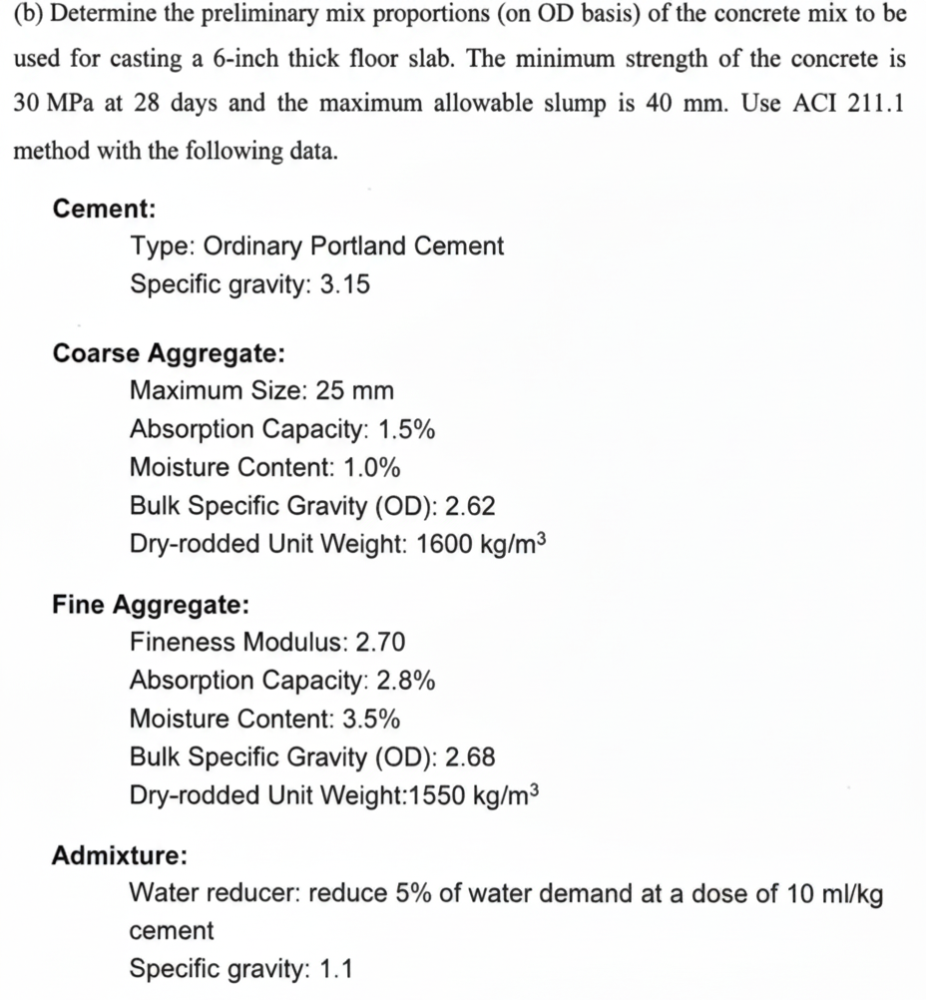
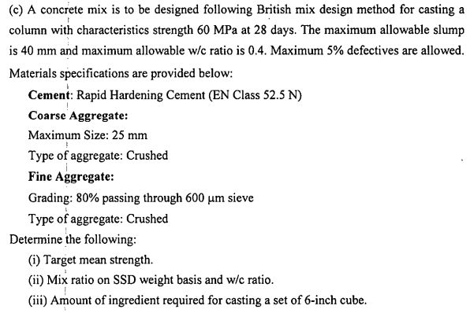

# CE 206: Engineering Computation Sessional – Concrete Mix Design

## 📘 Course Information

- **Course**: CE 206: Engineering Computation Sessional
- **Institution**: Bangladesh University of Engineering and Technology (BUET)
- **Academic Year**: 2022
- **Group**: Group 3 (6 Members)

## 📝 Project Overview

This repository contains MATLAB scripts developed as part of the CE 206 course at BUET to perform concrete mix designs based on ACI and British standards. The scripts allow users to input parameters such as material properties and desired strength, and automatically compute the required proportions for concrete mixes.

The project was completed in a team of six and presented with live MATLAB demonstrations to illustrate the functionality and accuracy of the scripts. The tool provides an efficient and practical approach for performing mix designs, reinforcing computational concepts learned in the course and serving as a reference for engineering students and professionals.

## 🔧 Features

- **ACI Mix Design**: Implemented according to the American Concrete Institute standards.
- **British Mix Design**: Developed following the British standards for concrete mix design.
- **User Input Parameters**: Allows input of material properties and desired strength.
- **Automated Calculations**: Computes the required proportions for concrete mixes based on input parameters.
- **Live Demonstration**: Presented with live MATLAB demonstrations to showcase functionality.

## 📸 Sample Questions

### ACI Mix Design

  
Click to view sample question

  

### British Mix Design

  
Click to view sample question

  

